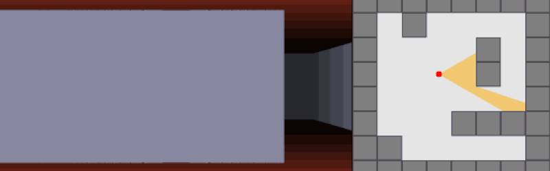

# Cub3D

## Table of Contents

- [Cub3D](#cub3d)
	- [Table of Contents](#table-of-contents)
	- [About ](#about-)
		- [What is raycasting ?](#what-is-raycasting-)
	- [Getting Started ](#getting-started-)
		- [Prerequisites](#prerequisites)
		- [Installing](#installing)
	- [Usage ](#usage-)
	- [Authors ](#authors-)
	- [Acknowledgements ](#acknowledgements-)

## About <a name = "about"></a>

This project is inspired by the world-famous Wolfenstein 3D game, which was the first FPS ever. It will enable you to explore ray-casting. Your goal will be to make a dynamic view inside a maze, in which you’ll have to find your way.

### What is raycasting ?

Raycasting is a rendering technique used in computer graphics and game development. The basic idea is to trace a path from an eye point (the camera), through a pixel on the screen, into the scene, and then determine what object in the scene is visible through that pixel.

This is done by "casting" a "ray" from the eye point, through the pixel, and into the scene, and checking for intersections with objects in the scene. The first object that the ray intersects is the one that is visible through that pixel.

Raycasting is used in a variety of applications, including 3D rendering, hit detection in games, and more. It's the basis for ray tracing, a more advanced and realistic rendering technique that simulates the actual physics of light.

<p align="center" styles="italic bold">
	<b><i>Image from https://hackaday.com/2021/09/13/ray-casting-101-makes-things-simple/</i></b>
	
</p>

## Getting Started <a name = "getting_started"></a>

These instructions will get you a copy of the project up and running on your local machine for development and testing purposes.

### Prerequisites

 - Make (to automate the compilation of the code)
 - Either GCC or Clang can be used as the compiler

### Installing

  1. Git clone the code
     ```
     git clone https://github.com/phlearning/cub3d.git
     ```
  2. Compile the code
     - Execute with `make` in your terminal while in the same folder as the makefile
  3. Run the app cub3D
     - Execute with `./cub3D map/cub3D.cub` in your terminal while in the same folder as the executable

## Usage <a name = "usage"></a>

- WASD are the default movement.
- Left arrow / Right arrow are the default keys to rotate the view.
- To run the app with different map: `./cub3D {path_to_map}`
  - The map is made in such format:
	```
	NO ./textures/xpm/bluestone.xpm
	SO ./textures/xpm/colorstone.xpm
	WE ./textures/xpm/greystone.xpm
	EA ./textures/xpm/mossy.xpm

	F 102,106,110
	C 199,228,255

	1111111111111111
	1E00000000000001
	1000001000000001
	1000001100000001
	1000000000000001
	1111000000000000001
	1000001000000001111
	1000000000100001
	1111111111111111
	```
	The NO, SO, WE, EA represent the wall textures depending on each direction (North, South, West, East).

	The F and the digits represents the Floor color in RGB.
	Respectively, C represents the Ceiling color in RGB.  

	The map is configured with the 1 being the wall, 0 being the walkable space and the E being the player initial position looking at the East direction when spawned in.
	Available direction:
	- N - North
	- E - East
	- W - West
	- S - South


## Authors <a name = "authors"></a>

- [bkukaqi](https://github.com/Rimble5)
- [pvong](https://github.com/phlearning)

## Acknowledgements <a name = "acknowledgements"></a>

- [Introduction to ray casting in 2D game engines](https://sszczep.dev/blog/ray-casting-in-2d-game-engines) (Show the maths and optimization possible)
- [Lode's Computer Graphics Tutorial Raycasting](https://lodev.org/cgtutor/raycasting.html) (Really useful)
- [Challenge ray-casting-2d](https://thecodingtrain.com/challenges/145-ray-casting-2d) (To understand raycasting in javascript)
- https://www.youtube.com/watch?v=g8p7nAbDz6Y (Raycasting)
